# 💧 Sistema de Clarificación Automatizado

Este repositorio contiene el desarrollo de un sistema automatizado para la **clarificación y potabilización de efluentes contaminados**, utilizando **Moringa Oleífera** como floculante natural.  
El proyecto se centra en ofrecer una solución **sostenible, de bajo costo y replicable** para comunidades rurales y zonas con recursos limitados.

<!-- 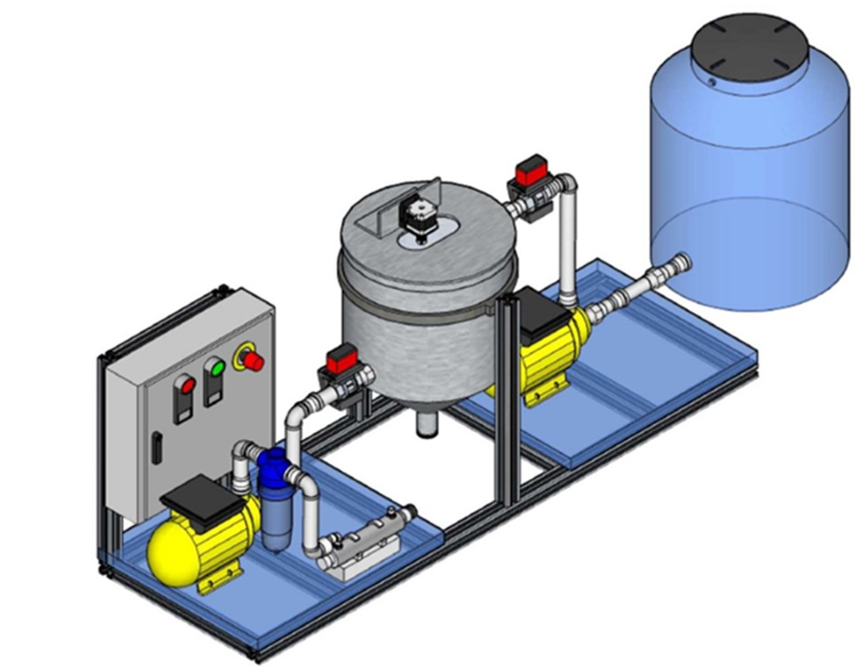{ width=50% }-->

**Modelo isométrico del sistema, proyección sólida**

---

## 🌍 Impacto

Este sistema busca contribuir al **ODS 6: Agua limpia y saneamiento**, proporcionando acceso a tecnologías de potabilización más **accesibles, seguras y sostenibles**.
---

## 👥 Estudiantes

Este proyecto es desarrollado por estudiantes del **Doctorado en Sistemas Computacionales** de la **Universidad del Sur**, para la materia de **Seminario Fundamentos de Ingeniería de Software** :

- **MTRO. ISRAEL VIVEROS TORRES** - *Inst. Tecnológico Superior de Alvarado, Veracruz*
- **MTRA. ASUNCIÓN DEL ROSARIO CORDERO GARCÍA** - *Universidad Autónoma del Carmen, Campeche*
- **MTRO. LUIS ÁNGEL MEDINA RODRÍGUEZ** - *Universidad Tecnológica y Politécnica del Valle del Carrizo*
- **MTRO. ALEJANDRO SAÚL BAÑOS VEGA** - *Instituto Tecnológico Latinoamericano, Hidalgo*
- **MTRA. ADELINA MARTÍNEZ NIETO** - *Instituto Tecnológico de Oaxaca, Oaxaca de Juárez*
- **MTRO. FEDERICO ARMANDO ARIAS ZAMBRANO** - *Inst. Tecnológico Superior de Zapopan, Jalisco*

**Asesor Académico:**  
**DR. JOSÉ ALEJANDRO CONCHA UICAB** - *Universidad del Sur*

---

## 🚀 Objetivo

Diseñar e implementar un **prototipo mecatrónico** que integre:
- 🌱 Uso de agentes orgánicos (Moringa Oleífera) en lugar de químicos sintéticos.
- ⚙️ Subsistemas mecánicos, electrónicos y de control.
- 📊 Monitoreo en tiempo real de parámetros de calidad de agua (NTU, TDS, DBO, DQO, pH, temperatura).
- 🖥️ Algoritmos en sistemas embebidos e interfaz de usuario.

---

## 🛠️ Tecnologías y Herramientas 

- **Gestión de Proyecto:** Jira Software, GitHub 
- **Control de Calidad de Código:** SonarQube
- **Simulación y Modelado:** MATLAB/Simulink
- **Desarrollo Embebido:** C/C++, Arduino/ESP32, sensores de turbidez, pH, TDS
- **Diseño Mecánico:** CAD (SolidWorks, Fusion 360), análisis FEA
- **Metodología:** Scrum con sprints de 3 semanas

---

## 📌 Metodología

El proyecto se gestiona bajo el marco ágil **Scrum**, con entregables incrementales en cada sprint:  
1. Requerimientos y diseño conceptual.  
2. Modelado matemático y simulación del proceso.  
3. Desarrollo mecánico, electrónico y de control.  
4. Integración del prototipo funcional.  
5. Validación experimental en campo.  

---
## 👨‍💼 👩‍💼 Roles Scrum en el Proyecto

| Rol | 👨‍💼 Responsable | 📝 Descripción |
| :--- | :--- | :--- |
| **💼 Product Owner (PO)** | **Israel** | Director del proyecto |
| **⚡ Scrum Master** | **Asunción, Luis** | Investigador principal de control y automatización |
| **👨‍🔧 Development Team** | **Federico, Adelina, Alex** | Ingenieros mecánicos, electrónicos, de software y equipo de campo |

---
## 📌 Cronograma

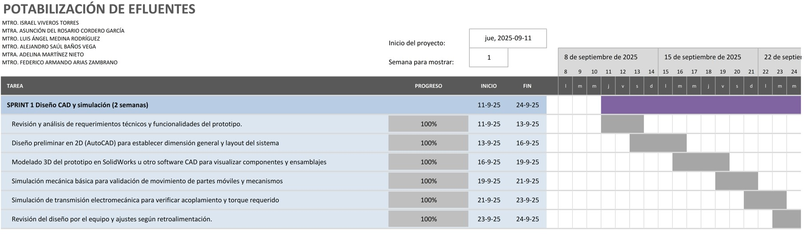
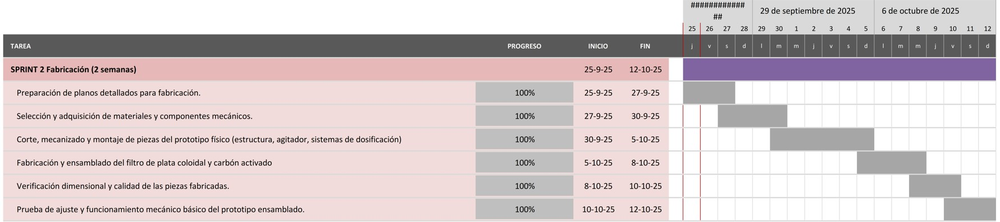
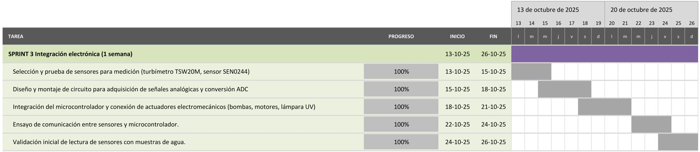
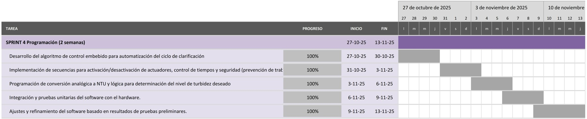
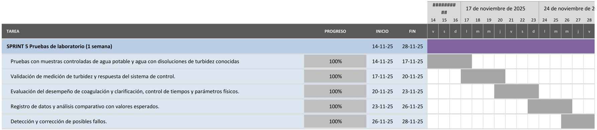
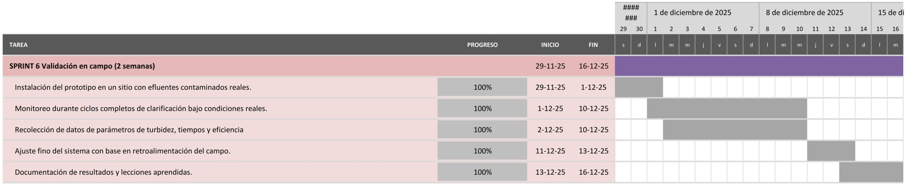
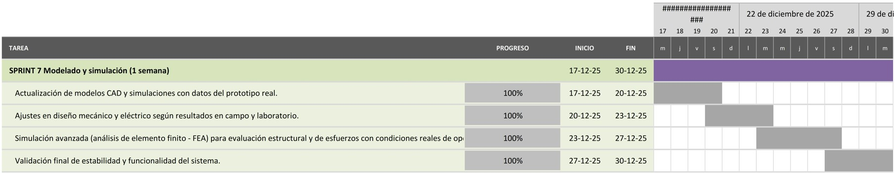

**Cronogama de actividades por sprints.**

---

## 📊 Metodología Ágil con Jira Software

### 🎯 Implementación de Scrum
Para garantizar una ejecución eficiente y organizada del proyecto, se implementó la metodología Scrum mediante **Jira Software**. Esta plataforma nos permite:

- **Gestión centralizada** de todas las actividades del proyecto
- **Planificación iterativa** mediante sprints
- **Seguimiento en tiempo real** del progreso de tareas
- **Visualización clara** de responsabilidades y avances
- **Retrospectivas continuas** para mejora del proceso

### 🔄 Flujo de Trabajo Establecido
El flujo de trabajo en Jira sigue el ciclo estándar de Scrum:
1. **Product Backlog Refinement** - Priorización y detalle de requerimientos
2. **Sprint Planning** - Selección y asignación de tareas para el sprint
3. **Daily Stand-ups** - Seguimiento diario del progreso
4. **Sprint Review** - Demostración de incrementos terminados
5. **Sprint Retrospective** - Identificación de mejoras del proceso

### 📈 Beneficios Obtenidos
La implementación de Jira ha permitido:
- **Transparencia total** en el estado del proyecto
- **Rápida identificación** de cuellos de botella
- **Mejor comunicación** entre los miembros del equipo
- **Documentación automática** de todo el proceso de desarrollo
- **Métricas objetivas** de productividad y calidad

**🔗 Enlace al proyecto:** [Tablero Jira del Proyecto](https://alejandrosaulvega.atlassian.net/jira/software/projects/SCRUM/boards/1?atlOrigin=eyJpIjoiNzFkNmZjNzYxOTIxNGFiOTg2ZmFmN2EyNWFiMzAzZTkiLCJwIjoiaiJ9)

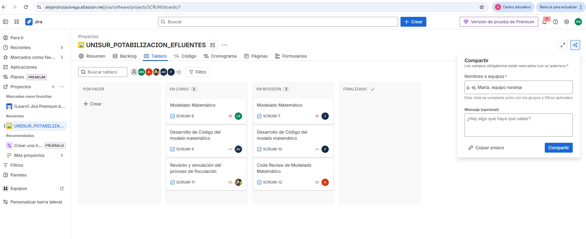

**Tablero de trabajo Jira.** 

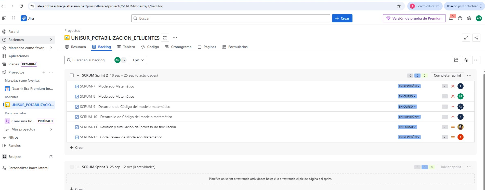

**Backlog Jira.**

---

## 📄 Estructura del Artículo Científico

### Plantilla **IEEE** Conference
Nuestro artículo científico fue desarrollado utilizando la plantilla oficial de la **Triple E Conference** (International Conference on Electrical, Electronic, and Energy), la cual sigue los estándares internacionales para publicaciones.

#### 📋 Características de la plantilla:
- **📐 Formato IEEE** de dos columnas
- **🏗️ Estructura académica** estándar: Abstract, Introducción, Metodología, Resultados, Discusión, Conclusiones
- **📊 Especificaciones técnicas** para figuras, tablas y ecuaciones
- **📚 Directrices de citación** y referencias bibliográficas
- **🔑 Orientación para keywords** y metadatos académicos

✅ Esta plantilla asegura que nuestra investigación cumple con los requisitos formales para su consideración en conferencias internacionales indexadas.

**🔗 Plantilla de referencia:** <a href="Articulo/Conference-LaTeX/conference_101719.pdf" target="_blank"> Ver artículo Realizado</a>

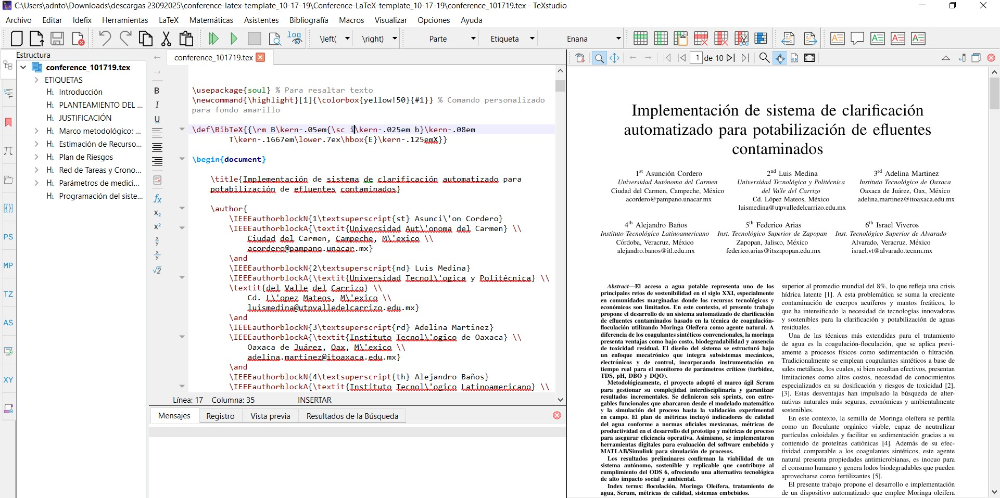
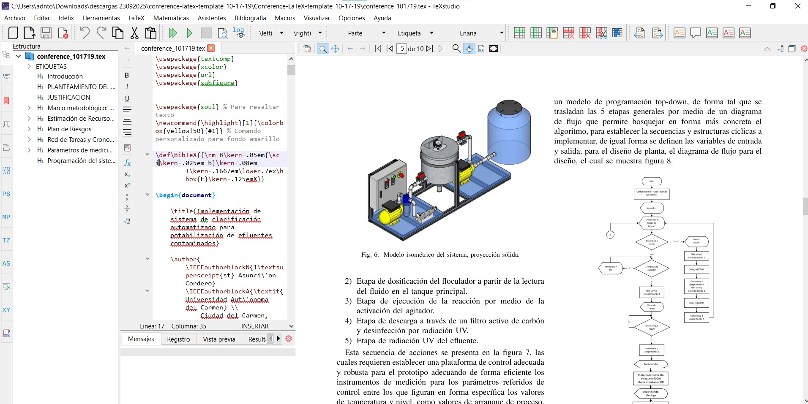

**Artículo en formato latex, mediante la aplicación TeXstudio** 

---